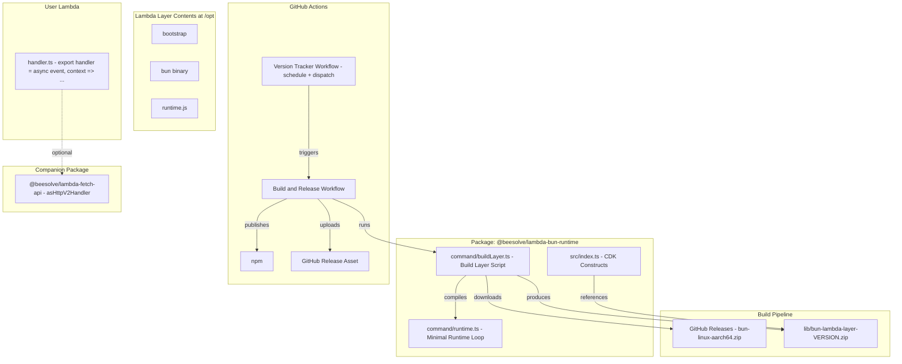
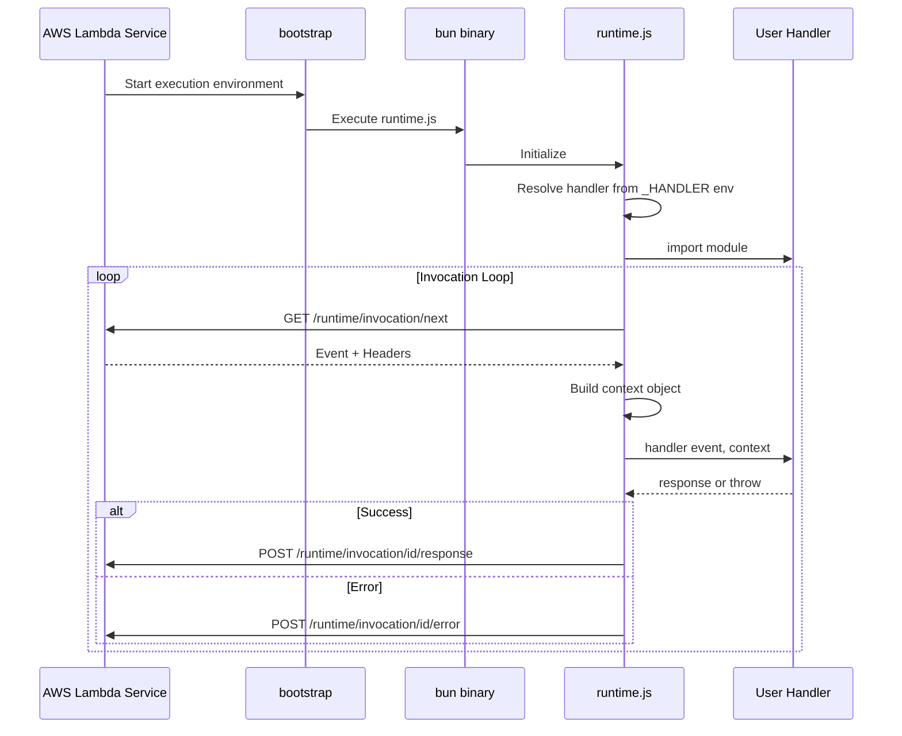

# Design Document

## Overview

This design describes the simplification and modernization of the `@beesolve/lambda-bun-runtime` package. The current implementation uses a ~500-line Fetch API-based runtime that converts Lambda events into `Request` objects and expects handlers to return `Response` objects. The new design replaces this with a minimal Node.js-style runtime (~80 lines) that passes raw `(event, context)` to handlers, delegates Fetch API conversion to the companion `@beesolve/lambda-fetch-api` package, and introduces a self-contained build pipeline.

Key design decisions:
- **Minimal runtime**: The runtime only implements the Lambda Runtime API loop — no event transformation, no WebSocket handling, no Fetch API conversion.
- **Direct GitHub release download**: The build layer script downloads the Bun binary from GitHub releases instead of cloning the Bun repository.
- **Bun-compiled runtime**: `runtime.ts` is bundled with `Bun.build()` into a single minified JS file before packaging.
- **`filename.handler` convention**: BunFunction defaults to `.handler` export name (not `.fetch`), matching Node.js Lambda conventions.
- **`.ts` and `.js` entrypoints**: BunFunction accepts both TypeScript and JavaScript entrypoints. When `.ts` is provided, the construct builds it with Bun during CDK synth via `Code.fromCustomCommand`.
- **Automated version tracking**: A GitHub Actions workflow polls for new Bun releases and triggers builds.
- **`Code.fromCustomCommand` for TS build**: Primary approach for TypeScript build during synth, with a pre-synth build step documented as fallback if DX proves insufficient.

## Architecture



### Runtime Execution Flow



## Components and Interfaces

### 1. Runtime (`command/runtime.ts`)

The runtime implements the AWS Lambda Runtime API loop in minimal form.

```typescript
// Core interfaces
interface LambdaContext {
  functionName: string;
  functionVersion: string;
  invokedFunctionArn: string;
  memoryLimitInMB: string;
  awsRequestId: string;
  logGroupName: string;
  logStreamName: string;
  getRemainingTimeInMillis(): number;
}

type Handler = (event: unknown, context: LambdaContext) => Promise<unknown> | unknown;

// Environment variables used
// AWS_LAMBDA_RUNTIME_API - Runtime API endpoint
// _HANDLER - "filename.exportName" format
// LAMBDA_TASK_ROOT - Handler code directory
// AWS_LAMBDA_FUNCTION_NAME, AWS_LAMBDA_FUNCTION_VERSION, etc.
```

**Responsibilities:**
- Poll `GET /runtime/invocation/next` for new invocations
- Parse `_HANDLER` as `filename.exportName` (split at last dot)
- Import handler module from `$LAMBDA_TASK_ROOT/filename`
- Construct `LambdaContext` from environment variables and response headers
- Call `handler(event, context)` and serialize the response as JSON
- Post response to `POST /runtime/invocation/{requestId}/response`
- Post errors to `POST /runtime/invocation/{requestId}/error` or `POST /runtime/init/error`

**What it does NOT do:**
- No HTTP event → Request conversion
- No Response → Lambda response formatting
- No WebSocket handling
- No `aws4fetch` dependency
- No `Bun.serve()` emulation

### 2. Build Layer Script (`command/buildLayer.ts`)

Replaces the current `buildLayer.sh`. Implemented in TypeScript, executable with Bun.

```typescript
// Inputs
// - BUN_VERSION env var (default) or CLI argument (override)
// - command/runtime.ts source file

// Outputs
// - lib/bun-lambda-layer-{version}.zip

// Steps:
// 1. Determine version from CLI arg or BUN_VERSION env
// 2. Download bun-linux-aarch64.zip from GitHub releases
// 3. Extract bun binary
// 4. Compile runtime.ts with Bun.build({ target: "bun", minify: true })
// 5. Generate bootstrap script
// 6. Package all into zip: bootstrap, bun, runtime.js
```

**Bootstrap script content:**
```bash
#!/bin/sh
exec /opt/bun /opt/runtime.js
```

**Zip structure:**
```
bootstrap          # Shell script that starts bun + runtime
bun                # Bun binary (linux-aarch64)
runtime.js         # Compiled runtime
```

### 3. CDK Constructs (`src/index.ts`)

#### BunFunction

```typescript
export interface BunFunctionProps {
  /** Path to the entrypoint — accepts .ts or .js files.
   *  If .ts is provided, the construct builds it with Bun during CDK synth.
   *  If .js is provided, it is used directly (pre-compiled). */
  readonly entrypoint: `${string}.ts` | `${string}.js`;
  /** Optional export name. Defaults to "handler" */
  readonly exportName?: string;
  /** Bun Lambda layer */
  readonly bunLayer: BunLambdaLayer;
  // ... inherits from NodejsFunctionProps (minus entry, runtime, architecture, handler, code, bundling)
}

export class BunFunction extends Function {
  constructor(scope: Construct, id: string, props: BunFunctionProps) {
    // Derives handler: "index.handler" from entrypoint "/path/to/index.ts"
    // If .ts: uses Code.fromCustomCommand to run bun build synchronously
    // If .js: uses Code.fromAsset(dirname(entrypoint)) directly
    // Sets runtime: PROVIDED_AL2023, architecture: ARM_64
  }
}
```

**Handler derivation logic:**
1. Extract base filename without extension from `entrypoint` prop (e.g., `"/app/src/handler.ts"` → `"handler"`)
2. Append `.` + `exportName` (default: `"handler"`)
3. Result: `"handler.handler"`

**TypeScript build logic (when `.ts` entrypoint is provided):**
1. Construct detects `.ts` extension
2. Uses `Code.fromCustomCommand` with a command that runs `bun build <entrypoint> --outdir <output> --target bun --minify`
3. The command executes synchronously during CDK synth via `spawnSync`
4. Output directory is used as the Lambda code asset

#### BunLambdaLayer

```typescript
export class BunLambdaLayer extends LayerVersion {
  constructor(scope: Construct, id: string, props?: BunLambdaLayerProps) {
    // References lib/bun-lambda-layer-VERSION.zip
    // ARM_64 architecture, PROVIDED_AL2023 runtime
  }
}
```

### 4. Version Tracker Workflow (`.github/workflows/bun-version-check.yml`)

```yaml
# Triggers: schedule (daily) + workflow_dispatch (manual with version input)
# Steps:
# 1. Fetch latest stable release from GitHub API (oven-sh/bun)
# 2. Compare against stored version (in a version file or release tags)
# 3. If new version detected, trigger build workflow with version input
```

### 5. Build & Release Workflow (`.github/workflows/build-layer.yml`)

```yaml
# Triggers: workflow_dispatch with version input, called by version tracker
# Steps:
# 1. Validate version format (semver)
# 2. Setup Bun
# 3. Run buildLayer.ts with BUN_VERSION
# 4. Run projen build (compile CDK constructs)
# 5. Create GitHub Release with layer zip as asset
# 6. Trigger npm publish
```

## Data Models

### Lambda Context Object

```typescript
interface LambdaContext {
  /** Function name from AWS_LAMBDA_FUNCTION_NAME */
  functionName: string;
  /** Function version from AWS_LAMBDA_FUNCTION_VERSION */
  functionVersion: string;
  /** Invoked function ARN from Lambda-Runtime-Invoked-Function-Arn header */
  invokedFunctionArn: string;
  /** Memory limit from AWS_LAMBDA_FUNCTION_MEMORY_SIZE */
  memoryLimitInMB: string;
  /** Request ID from Lambda-Runtime-Aws-Request-Id header */
  awsRequestId: string;
  /** Log group from AWS_LAMBDA_LOG_GROUP_NAME */
  logGroupName: string;
  /** Log stream from AWS_LAMBDA_LOG_STREAM_NAME */
  logStreamName: string;
  /** Returns ms remaining before timeout, derived from Lambda-Runtime-Deadline-Ms header */
  getRemainingTimeInMillis(): number;
}
```

### Runtime Error Format

```typescript
interface LambdaError {
  /** Error class name or "Error" for non-Error throws */
  errorType: string;
  /** Error message or inspected value */
  errorMessage: string;
  /** Stack trace lines (optional) */
  stackTrace?: string[];
}
```

### Build Layer Configuration

| Parameter | Source | Description |
|-----------|--------|-------------|
| `version` | CLI arg > `BUN_VERSION` env | Bun version to package |
| `downloadUrl` | Derived | `https://github.com/oven-sh/bun/releases/download/bun-v{version}/bun-linux-aarch64.zip` |
| `outputPath` | Fixed | `lib/bun-lambda-layer-{version}.zip` |

### Handler Resolution

| `_HANDLER` value | Filename | Export Name | Import Path |
|------------------|----------|-------------|-------------|
| `index.handler` | `index` | `handler` | `$LAMBDA_TASK_ROOT/index` |
| `src/app.myFunc` | `src/app` | `myFunc` | `$LAMBDA_TASK_ROOT/src/app` |
| `handler` (no dot) | Invalid | — | Error: init/error |

## Correctness Properties

*A property is a characteristic or behavior that should hold true across all valid executions of a system — essentially, a formal statement about what the system should do. Properties serve as the bridge between human-readable specifications and machine-verifiable correctness guarantees.*

### Property 1: Handler string resolution splits at last dot

*For any* string containing at least one dot character, splitting at the last dot SHALL produce a `filename` equal to everything before the last dot and an `exportName` equal to everything after the last dot.

**Validates: Requirements 1.2**

### Property 2: Event passthrough preserves data

*For any* valid JSON-serializable value used as a Lambda event, the runtime SHALL pass the exact parsed object to the handler without modification — i.e., `JSON.parse(JSON.stringify(event))` deep-equals the value received by the handler.

**Validates: Requirements 1.4, 1.6**

### Property 3: Context object construction

*For any* set of environment variable values (functionName, functionVersion, memoryLimitInMB, logGroupName, logStreamName) and response header values (awsRequestId, invokedFunctionArn, deadlineMs), the constructed context object SHALL contain all fields matching their source values, and `getRemainingTimeInMillis()` SHALL return a value equal to `deadlineMs - Date.now()` (within timing tolerance).

**Validates: Requirements 1.5**

### Property 4: Error formatting preserves error information

*For any* Error object with a `name` and `message`, `formatError` SHALL produce an object where `errorType` equals the error's `name`, `errorMessage` equals the error's `message`, and `stackTrace` (if the error has a stack) is an array of strings. For any non-Error thrown value, `errorType` SHALL be `"Error"` and `errorMessage` SHALL be the inspected string representation.

**Validates: Requirements 1.8**

### Property 5: BunFunction handler derivation from entrypoint

*For any* valid file path string ending in `.js` or `.ts` that contains a parseable basename, the CDK construct SHALL derive a handler string equal to `<basename_without_extension>.<exportName>` where `exportName` defaults to `"handler"` when not provided, and uses the user-supplied value when provided.

**Validates: Requirements 3.1, 3.2, 3.3**

### Property 6: Version parameter precedence

*For any* pair of version strings (one as CLI argument, one as BUN_VERSION environment variable), the resolved version SHALL equal the CLI argument when present, and SHALL equal the environment variable when the CLI argument is absent.

**Validates: Requirements 2.6**

### Property 7: Semver validation

*For any* string matching the pattern `{positive_integer}.{non_negative_integer}.{non_negative_integer}`, the validation function SHALL accept it. *For any* string not matching this pattern, the validation function SHALL reject it.

**Validates: Requirements 4.7**

## Error Handling

### Runtime Errors

| Error Scenario | Endpoint | Error Type | Behavior |
|---|---|---|---|
| `_HANDLER` missing or no dot | `POST /runtime/init/error` | `Runtime.InvalidHandler` | Exit process after posting |
| Handler module not found | `POST /runtime/init/error` | `Runtime.ModuleNotFound` | Exit process after posting |
| Handler export not a function | `POST /runtime/init/error` | `Runtime.HandlerNotFunction` | Exit process after posting |
| Handler throws during invocation | `POST /runtime/invocation/{id}/error` | Error name from thrown value | Continue loop |
| Handler times out | `POST /runtime/invocation/{id}/error` | `Runtime.Timeout` | Continue loop |
| Runtime API unreachable | — | — | `process.exit(1)` immediately |

**Design decisions:**
- Init errors are fatal — the runtime exits after posting. This matches AWS Lambda behavior where init failures prevent further invocations.
- Invocation errors are non-fatal — the runtime continues polling for the next invocation.
- Network errors to the Runtime API itself are unrecoverable — the process exits.

### Build Layer Script Errors

| Error Scenario | Exit Code | Message |
|---|---|---|
| No version provided (no CLI arg, no env var) | 1 | "No Bun version specified. Set BUN_VERSION or pass as argument." |
| Invalid version format | 1 | "Invalid version format: {input}. Expected semver (e.g., 1.3.13)." |
| Download fails (404) | 1 | "Failed to download Bun v{version}: release not found." |
| Download fails (network) | 1 | "Failed to download Bun v{version}: {error message}" |
| Bun.build() fails | 1 | "Failed to compile runtime.ts: {error message}" |
| Zip creation fails | 1 | "Failed to create layer zip: {error message}" |

### CDK Construct Errors

| Error Scenario | Error Type | Message |
|---|---|---|
| Entrypoint has no parseable basename | `Error` | "Cannot derive handler from entrypoint: {path}" |
| Layer zip file not found at expected path | CDK synthesis error | Standard CDK asset error |

## Testing Strategy

### Unit Tests (Example-Based)

Unit tests cover specific scenarios, edge cases, and integration points:

- **Runtime handler resolution edge cases**: missing `_HANDLER`, no dot in handler string, handler at nested path
- **Runtime undefined return**: handler returns `undefined` → response is `null`
- **Runtime module not found**: non-existent module → init/error posted
- **Build script bootstrap content**: verify exact bootstrap script output
- **Build script zip structure**: verify entries are at root level (no subdirectories)
- **CDK construct invalid entrypoint**: empty string, path with no basename → throws

### Property-Based Tests

Property-based tests verify universal correctness properties using [fast-check](https://github.com/dubzzz/fast-check) (the standard PBT library for TypeScript/JavaScript).

**Configuration:**
- Minimum 100 iterations per property
- Each test tagged with: `Feature: simplified-bun-lambda-runtime, Property {N}: {title}`

**Properties to implement:**

1. **Handler string resolution** — Generate strings with dots at various positions, verify split logic
2. **Event passthrough** — Generate arbitrary JSON values, verify they pass through unchanged
3. **Context construction** — Generate random env/header values, verify context fields
4. **Error formatting** — Generate Error objects with random names/messages/stacks, verify output structure
5. **BunFunction handler derivation** — Generate valid `.js` file paths, verify derived handler string
6. **Version precedence** — Generate version string pairs, verify CLI > env precedence
7. **Semver validation** — Generate random strings (both valid and invalid semver), verify acceptance/rejection

### Integration Tests

Integration tests verify end-to-end behavior with real or mocked external services:

- **Runtime loop**: Mock Lambda Runtime API HTTP server, verify full poll → invoke → respond cycle
- **Build layer script**: Run the actual build (in CI) with a known Bun version, verify zip output
- **CDK synth**: Synthesize a stack with BunFunction, verify CloudFormation output has correct handler value

### Test Framework

- **Test runner**: Bun's built-in test runner (`bun test`)
- **PBT library**: `fast-check` (devDependency only — not shipped to consumers)
- **Assertions**: Bun's built-in `expect` (Jest-compatible)

**Why fast-check?** Bun's test runner doesn't include a built-in property-based testing library. `fast-check` is the standard PBT library for the JS/TS ecosystem, well-maintained, and added only as a devDependency so it has zero impact on the published package size.

## Research: TypeScript Build Integration in CDK Synth

### Problem Statement

CDK construct constructors run synchronously during synthesis. `Bun.build()` is an async API. The question is whether BunFunction can accept a `.ts` entrypoint and produce bundled JS during `cdk synth`.

**Decision:** Implement approach (a) as the primary mechanism. Keep approach (d) documented as a fallback if (a) proves to have poor DX in practice.

### Implemented Approach: (a) Bun.spawnSync via Code.fromCustomCommand

**How it works:** When BunFunction receives a `.ts` entrypoint, it uses `Code.fromCustomCommand` to run `bun build` synchronously during CDK synth. The command produces a bundled `.js` file in an output directory, which CDK packages as a Lambda code asset.

```typescript
// Internal implementation sketch
if (entrypoint.endsWith('.ts')) {
  code = Code.fromCustomCommand(outputDir, ['bun', 'build', entrypoint, '--outdir', outputDir, '--target', 'bun', '--minify']);
} else {
  code = Code.fromAsset(dirname(entrypoint));
}
```

**Why this works:**
- `Code.fromCustomCommand` spawns a synchronous child process (uses `spawnSync` internally)
- It's a supported CDK API designed for exactly this use case
- Since consumers of `BunFunction` already have Bun installed (they're deploying Bun Lambda functions), the `bun` binary is available on the synth machine
- Build runs during `cdk synth`, no separate step needed
- Compatible with `cdk synth` and `cdk deploy` workflows

**Trade-offs:**
- Requires Bun installed on the machine running `cdk synth` (acceptable — users already have it)
- Build runs every synth (CDK caches via asset hash, so unchanged source won't re-upload)
- Error messages from build failures surface as CDK synthesis errors

**Constraints:**
- Cannot use Bun.build() plugins that require the parent process context
- Output must be a single file or directory that CDK can package

### Fallback Approach: (d) Pre-synth Build Step

If approach (a) proves to have poor developer experience (e.g., slow synth times, confusing error messages, issues with CDK Pipelines), the fallback is a pre-synth build command.

**How it works:** A CLI command (e.g., `bun run build-handlers`) scans the project for `.ts` entrypoints referenced by BunFunction constructs and builds them to a `dist/` directory. The construct then references the pre-built `.js` files.

**Usage pattern:**
```bash
bun run build-handlers  # builds all .ts handlers to dist/
cdk synth               # references pre-built .js files
```

**When to fall back:**
- If `Code.fromCustomCommand` causes issues in CDK Pipelines
- If synth times become unacceptable for large projects
- If error reporting from spawned builds is confusing

**Implementation notes:**
- The build command would read a manifest or scan CDK code for BunFunction usage
- Output goes to a conventional `dist/` directory
- The construct would accept both `.ts` (for approach a) and `.js` (for pre-built) entrypoints

### Other Evaluated Approaches (Not Viable)

#### (b) CDK Aspects — NOT VIABLE

Aspects visit all constructs after the tree is built but before synthesis completes. However, Aspects run synchronously and cannot modify asset paths after construct creation. The `Code` property is set in the constructor and cannot be changed by an Aspect.

#### (c) Custom synthesis hooks — NOT VIABLE

Overriding `synthesize()` on the stack is technically possible but fragile. It requires overriding internal CDK lifecycle methods, breaks with CDK Pipelines, and is not a supported public API pattern.

